# Covid-19 Worldwide Numbers

An app built for [Flutter UI Challenge #1](https://docs.google.com/forms/d/e/1FAIpQLSeIy3Ov8IjzK42Xc2x__g-T0hbjnNJAyySfyc36GlEGQ_HUeg/viewform).

## Features

### Map and numbers

Official WHO data is fetched directly from [covid19.who.int](https://covid19.who.int/WHO-COVID-19-global-data.csv).
The number of new/total cases/deaths for each country is color coded in the world map.
Detailed numbers are shown in full in a data table.

| iPhone | iPad | iPad landscape |
| --- | --- | --- |
| 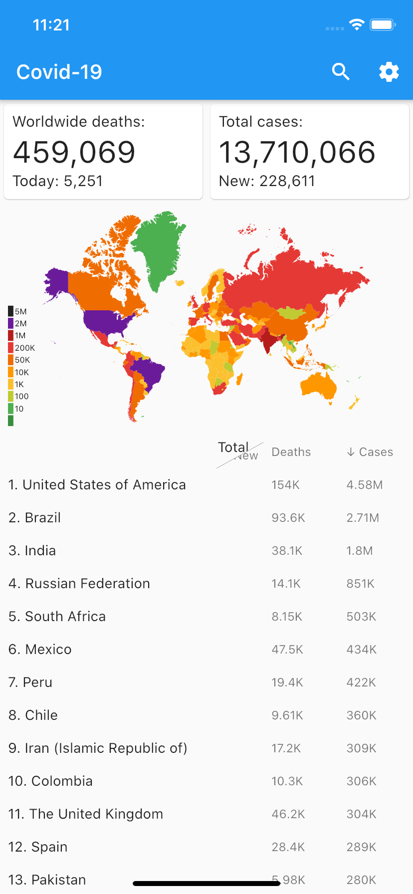 | 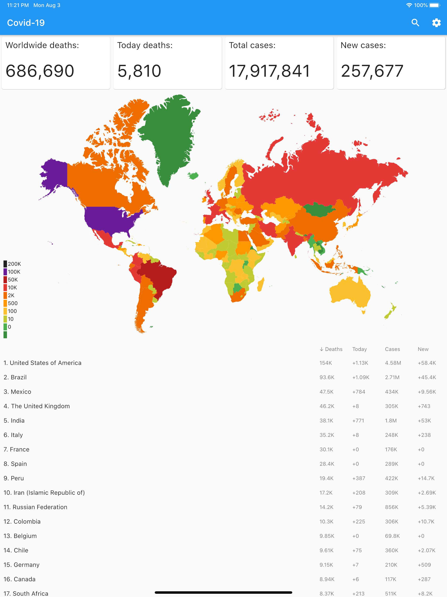 | 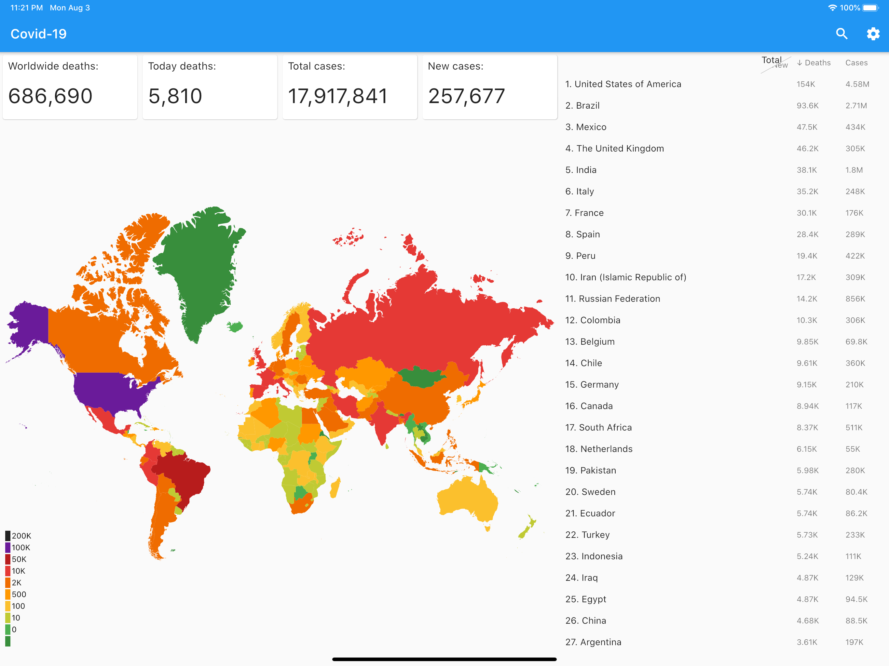 |

### Search

User current location is detected by IP address (no additional permissions required).
Recent searches are also saved for easy access.

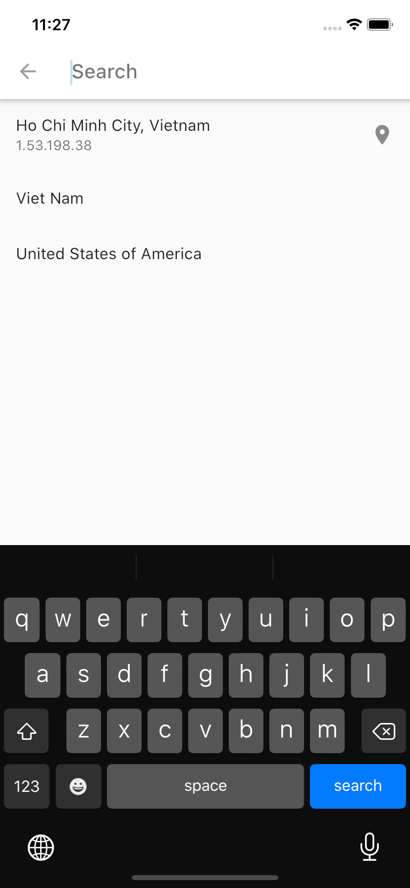

### Country highlight

A country can be highlighted from search result or by tapping its name in the data table.
The highlighted one will be zoomed in on the world map.
Its numbers are displayed prominently on top with accompanied graphs.

| iPhone on Vietnam | iPad on USA |
| --- | --- |
| 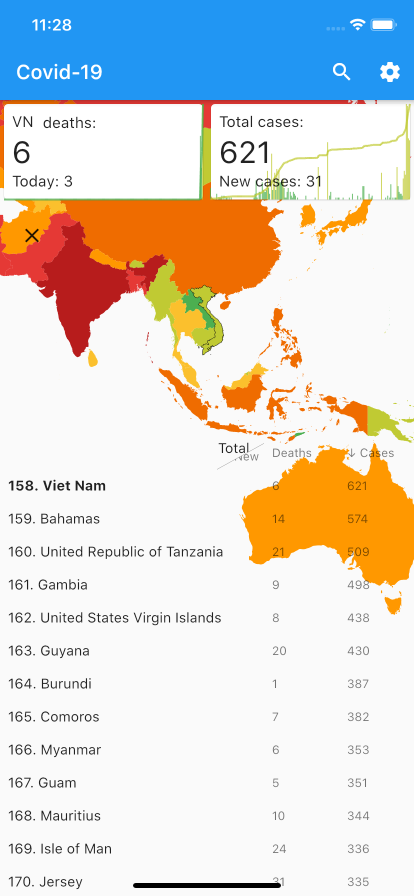 |  |

### Sorting

The data table supports 8 sorting orders:

- New cases ascending / descending
- Total cases ascending / descending
- New deaths ascending / descending
- Total deaths ascending / descending

| New cases descending | Total cases descending | New deaths descending | Total deaths descending |
| --- | --- | --- | --- |
| 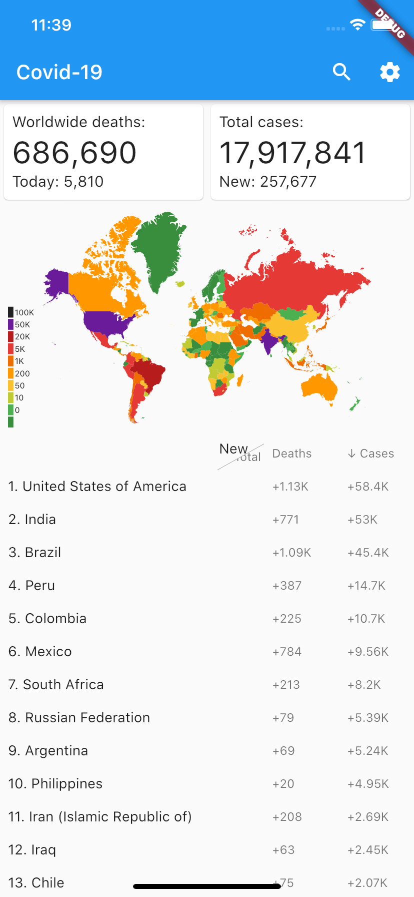 | 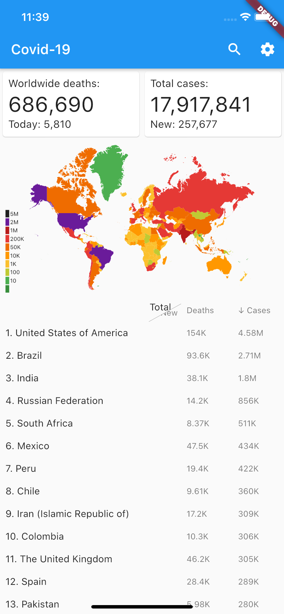 | 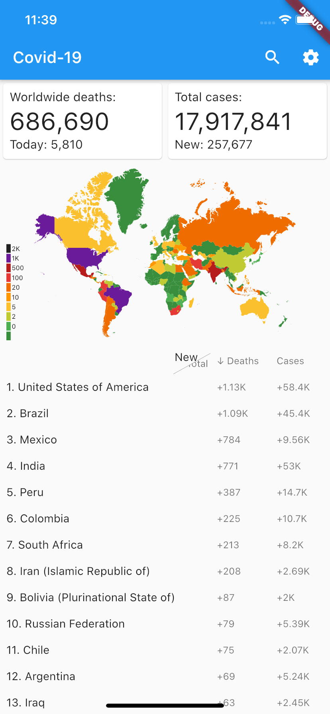 | 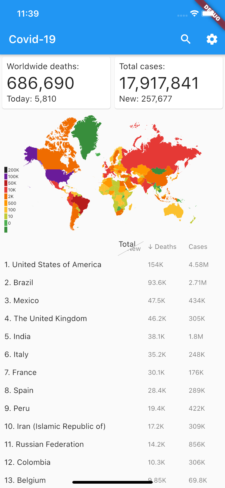 |

### Animation

Subtle animations are used throughout the app to improve user experiences.
Some notable ones:

| Progress indicator | Map (zoom+pan) | Total / new toggler (mobile only) |
| --- | --- | --- |
|  | 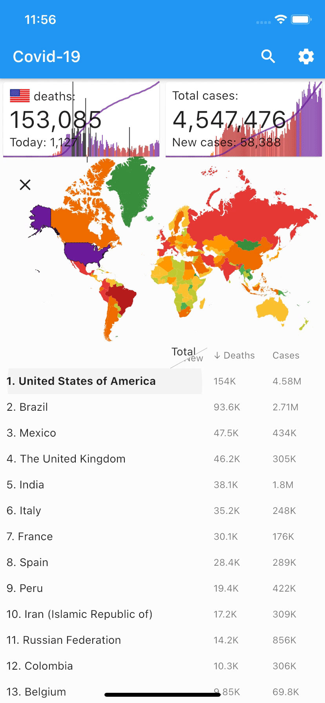 | 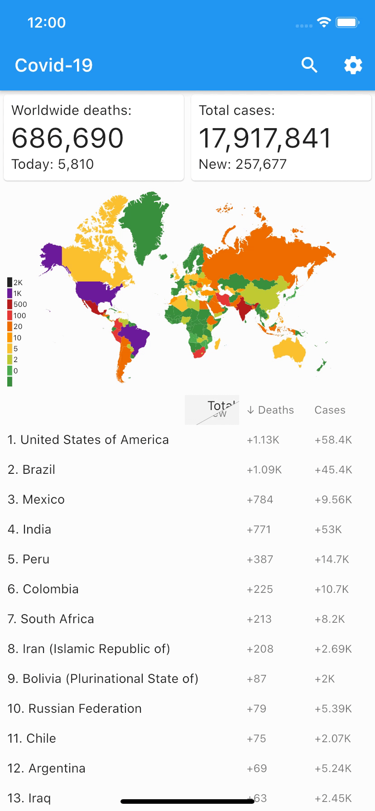 |
